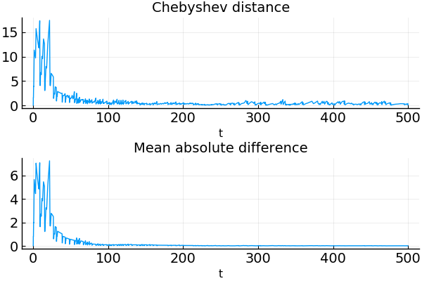
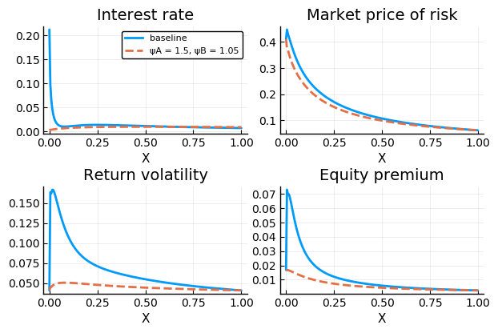

# A Replication Exercise of Garleanu and Panageas (2015)

In this notebook, I seek to solve the model developed by [Garleanu and Panageas (2015)](http://dx.doi.org/10.1086/680996) and replicate their main results (plots). I greatly benefited from a similar exercise done by [Matthieu Gomez](https://github.com/matthieugomez).

To get started, the following modules should be in place:


```julia
using ParDiffEqnSuite
using StaticArrays
using DifferentialEquations
using BenchmarkTools
using Plots
using Printf
using Distances
```

where `ParDiffEqnSuite.jl` is a user-defined module that can be found in `./src/`.

## Preparation

### Type definition

The first parametric composite type is used to store model parameters.


```julia
struct ModelParam{T}
    # utility function
    γA::T
    ψA::T 
    γB::T 
    ψB::T
    ρ::T 
    φ::T

    # proportion a
    νA::T

    # consumption
    μ::T
    σ::T

    # earning function
    B1::T 
    δ1::T
    B2::T 
    δ2::T
    ω::T
        
    # suppress generation of default constructors
    function ModelParam(; T = Float64,
                        γA  = 1.5, ψA = 0.7, γB = 10.0, ψB = 0.05, 
                        ρ = 0.001, φ = 0.02, νA = 0.01, μ = 0.02, σ = 0.041, 
                        B1 = 30.72, δ1 = 0.0525, B2 = -30.29, δ2 = 0.0611, ω = 0.92)
        scale = φ / (φ + δ1) * B1 + φ / (φ + δ2) * B2
        B1 = B1 / scale
        B2 = B2 / scale
        return new{T}(γA , ψA, γB, ψB, ρ, φ, νA, μ, σ, B1, δ1, B2, δ2, ω)
    end
end
```

One can construct a new `ModelParam` object by calling `x = ModelParam()`, which will deploy the baseline parameter values from the paper. Or instead, one can deviate from the baseline by calling something like `x = ModelParam(ψA = 0.9, ψB = 0.5)` to change one or more paramter values while keeping the others the same. The default number type is `Float64`, but one can choose `T = BigFloat` for higher precision.

The second composite type is used to store discretized state variables.


```julia
struct StateVars{T, dim1} # add dim2, dim3, ... if more than one state variable
    x::SVector{dim1, T}
    
    function StateVars(dim1; T = Float64)
        x = SVector{dim1, T}(range(zero(T), stop=one(T), length=dim1))
        return new{T, dim1}(x)
    end
end
```

Note that static arrays, instead of regular ones, are used for better performance. Static arrays conveniently keep the length as a type parameter, which will be repeatedly used later. There is only one state variable in this model whose value ranges from 0 to 1, but this composite type can be easily extended to accommodate more state variables with other ranges or discretization methods.

The third composite type is used to store everything including model solution.


```julia
struct ModelSol{T, dim1} # add dim2, dim3, ... if more than one state variable
    param::ModelParam{T}
    state::StateVars{T, dim1}
    sol::Dict{Symbol, StaticVector{dim1, T}}
    
    function ModelSol(param::ModelParam{T}, state::StateVars{T, dim1}) where {T, dim1}
        sol = Dict{Symbol, StaticVector{dim1, T}}()
        return new{T, dim1}(param, state, sol)
    end
end
```

The model solution is a set of equilibrium quantities represented by static arrays, which contain (approximate) values of these quantities at every (discretized) state of the model economy.

### Function definition

The equilibrium is characterized by a system of ordinary differential equations, which is solved by adding a pseudo time dimension and iterating backward in time until convergence. I carry out this procedure by exploiting `DifferentialEquations.jl`, which requires defining the problem in a function like below.


```julia
function pde!(du, u, p, t)
    param, state = p
    
    γA = param.γA ; ψA = param.ψA ; 
    γB = param.γB ; ψB = param.ψB ; 
    ρ = param.ρ ; φ = param.φ ; νA = param.νA ; 
    μ = param.μ ; σ = param.σ ; 
    B1 = param.B1 ; δ1 = param.δ1 ; 
    B2 = param.B2 ; δ2 = param.δ2 ; ω = param.ω ;
    
    for i in 1:length(state.x)
        x = state.x[i]
        
        pA = u[i,1] ; pAx, pAxx = fntdiff1d(state.x, view(u,:,1), i);
        pB = u[i,2] ; pBx, pBxx = fntdiff1d(state.x, view(u,:,2), i);
        ϕ1 = u[i,3] ; ϕ1x, ϕ1xx = fntdiff1d(state.x, view(u,:,3), i);
        ϕ2 = u[i,4] ; ϕ2x, ϕ2xx = fntdiff1d(state.x, view(u,:,4), i);
        
        # volatility of X, pA, pB, ϕ1, ϕ2, CA, CB and market price of risk κ
        Γ = 1 / (x / γA + (1 - x) / γB)
        p = x * pA + (1 - x) * pB
        σx = σ * x * (Γ / γA - 1) / (1 + Γ * x * (1 - x) / (γA * γB) * ((1 - γB * ψB) / (ψB - 1) * (pBx / pB) - (1 - γA * ψA) / (ψA - 1) * (pAx / pA)))
        σpA = pAx / pA * σx
        σpB = pBx / pB * σx 
        σϕ1 = ϕ1x / ϕ1 * σx
        σϕ2 = ϕ2x / ϕ2 * σx
        κ = Γ * (σ - x * (1 - γA * ψA) / (γA * (ψA - 1)) * σpA - (1 - x) * (1 - γB * ψB) / (γB * (ψB - 1)) * σpB)
        σCA = κ / γA + (1 - γA * ψA) / (γA * (ψA - 1)) * σpA
        σCB = κ / γB + (1 - γB * ψB) / (γB * (ψB - 1)) * σpB
        
        # drift of X, pA, pB, ϕ1, ϕ2, CA, CB and interest rate r
        # A.16 Equation in Garleanu Panageas has a typo
        mcA = κ^2 * (1 + ψA) / (2 * γA) + (1 - ψA * γA) / (γA * (ψA - 1)) * κ * σpA - (1 - γA * ψA) / (2 * γA * (ψA - 1)) * σpA^2
        mcB = κ^2 * (1 + ψB) / (2 * γB) + (1 - ψB * γB) / (γB * (ψB - 1)) * κ * σpB - (1 - γB * ψB) / (2 * γB * (ψB - 1)) * σpB^2
        r =  ρ + 1 / (ψA * x  + ψB * (1 - x))  * (μ - x * mcA - (1 - x) * mcB - φ * ((νA / pA + (1 - νA) / pB) * (ϕ1 + ϕ2) - 1))
        μCA = ψA * (r - ρ) + mcA
        μCB = ψB * (r - ρ) + mcB
        μx = x * (μCA - φ - μ) + φ * νA / pA * (ϕ1 + ϕ2) - σ * σx  
        μpA = pAx / pA * μx + 0.5 * pAxx / pA * σx^2
        μpB = pBx / pB * μx + 0.5 * pBxx / pB * σx^2
        μϕ1 = ϕ1x / ϕ1 * μx + 0.5 * ϕ1xx / ϕ1 * σx^2
        μϕ2 = ϕ2x / ϕ2 * μx + 0.5 * ϕ2xx / ϕ2 * σx^2
        
        du[i,1] = pA * (1 / pA + (μCA - φ) + μpA + σCA * σpA - r - κ * (σpA + σCA))
        du[i,2] = pB * (1 / pB + (μCB - φ) + μpB + σCB * σpB - r - κ * (σpB + σCB))
        du[i,3] = ϕ1 * (B1 * ω / ϕ1 + (μ - φ - δ1) + μϕ1 + σ * σϕ1 - r - κ * (σϕ1 + σ))
        du[i,4] = ϕ2 * (B2 * ω / ϕ2 + (μ - φ - δ2) + μϕ2 + σ * σϕ2 - r - κ * (σϕ2 + σ))
    end    
end
```

(Thanks to [Matthieu Gomez](https://github.com/matthieugomez), I skipped a lot of typing in this step.)

I provide two ways of visually checking convergence. 


```julia
# check convergence via visualizations

# 1. show distance between consecutive updates
function isconverge1(sol::ODESolution)
    pyplot()
    
    p = plot(layout = @layout [a{0.5h}; b{0.5h}])
    plot!(p[1], sol.t[2:end], 
          [chebyshev(sol.u[i-1], sol.u[i]) for i=2:length(sol.t)],
          title = "Chebyshev distance"
         )
    plot!(p[2], sol.t[2:end], 
          [meanad(sol.u[i-1], sol.u[i]) for i=2:length(sol.t)],
          title = "Mean absolute difference"
         )
    plot!(xguide = "t",
          tickfontsize = 14,
          legend = :none
         )
    
    return p
end

# 2. evolution from initial guess to final update (this step can take a few minutes)
function isconverge2(ms::ModelSol, sol::ODESolution)
    pyplot()
    
    anim = @animate for it=1:length(sol.t)
        p = plot(layout = @layout [a{0.5h, 0.5w} b{0.5h, 0.5w}; 
                                   c{0.5h, 0.5w} d{0.5h, 0.5w}]
                )
        plot!(p[1], ms.state.x, 
              sol.u[it][:,1], 
              linewidth = 2,
              ylims = (0,40),
              yguide = "pA"
             )
        plot!(p[2], ms.state.x, 
              sol.u[it][:,2], 
              linewidth = 2,
              ylims = (0,35),
              yguide = "pB"
             )
        plot!(p[3], ms.state.x, 
              sol.u[it][:,3], 
              linewidth = 2,
              ylims = (0,450),
              yguide = "ϕ1"
             )
        plot!(p[4], ms.state.x, 
              sol.u[it][:,4], 
              linewidth = 2,
              ylims = (-400,0),
              yguide = "ϕ2"
             )
        plot!(xguide = "X",
              tickfontsize = 10,
              legend = :none,
              title = "t = " * @sprintf "%6.2f" sol.t[it]
             )
    end
        
    return gif(anim, fps = 100)
end
```

## Solution

As everything is ready, let's solve the model!

### Baseline


```julia
# Set density of the grid
dim1 = 200

# Use BigFloat for higher precision if necessary
T = Float64 

# Initialization
msV0 = ModelSol(ModelParam(), StateVars(dim1))

# @benchmark 
begin
    p = (msV0.param, msV0.state)
    u0 = fill(one(T), dim1, 4)
    sol = solve(ODEProblem(pde!, u0, (0.0, 500.0), p), 
                CVODE_BDF(linear_solver=:GMRES), 
                dense = false,
                save_everystep = true # could be set to false after convergence confirmed
               )
end

begin
    msV0.sol[:pA] = Size(dim1)(sol.u[end][:,1])
    msV0.sol[:pB] = Size(dim1)(sol.u[end][:,2])
    msV0.sol[:ϕ1] = Size(dim1)(sol.u[end][:,3])
    msV0.sol[:ϕ2] = Size(dim1)(sol.u[end][:,4])
end;
```

### Showcasing convergence


```julia
isconverge1(sol)
```





```julia
# this step is optional and can take a few minutes
isconverge2(msV0, sol)
```


" />


### Parameter variation: ψA = 1.5, ψB = 1.05


```julia
# Set density of the grid
dim1 = 200

# Use BigFloat for higher precision if necessary
T = Float64 

# Initialization
msV1 = ModelSol(ModelParam(ψA = 1.5, ψB = 1.05), StateVars(dim1))

# @benchmark 
begin
    p = (msV1.param, msV1.state)
    u0 = fill(one(T), dim1, 4)
    sol = solve(ODEProblem(pde!, u0, (0.0, 100.0), p), 
                ARKODE(Sundials.Implicit(), order = 5), 
                dense = true,
                save_everystep = true # could be set to false after convergence confirmed
               )
    u0 = sol.u[end]
    sol = solve(ODEProblem(pde!, u0, (0.0, 50.0), p), 
                CVODE_BDF(method=:Functional),
                dense = false,
                save_everystep = true # could be set to false after convergence confirmed
               )
end

begin
    msV1.sol[:pA] = Size(dim1)(sol.u[end][:,1])
    msV1.sol[:pB] = Size(dim1)(sol.u[end][:,2])
    msV1.sol[:ϕ1] = Size(dim1)(sol.u[end][:,3])
    msV1.sol[:ϕ2] = Size(dim1)(sol.u[end][:,4])
end;
```

## Postprocessing

Based on the core equilibrium quantities attained above, all the other quantities of interest can be computed.


```julia
function complete!(ms::ModelSol{T, dim1}) where {T, dim1}
    param, state, sol = ms.param, ms.state, ms.sol
    
    γA = param.γA ; ψA = param.ψA ; 
    γB = param.γB ; ψB = param.ψB ; 
    ρ = param.ρ ; φ = param.φ ; νA = param.νA ; 
    μ = param.μ ; σ = param.σ ; 
    B1 = param.B1 ; δ1 = param.δ1 ; 
    B2 = param.B2 ; δ2 = param.δ2 ; ω = param.ω ;
    
    sol[:μx] = Size(dim1)(fill(NaN,dim1))
    sol[:σx] = Size(dim1)(fill(NaN,dim1))
    sol[:s]  = Size(dim1)(fill(NaN,dim1))
    sol[:σS] = Size(dim1)(fill(NaN,dim1))
    sol[:r]  = Size(dim1)(fill(NaN,dim1))
    sol[:κ]  = Size(dim1)(fill(NaN,dim1))
    
    @. sol[:s] = state.x * sol[:pA] + (1 - state.x) * sol[:pB] - 
                 (φ / (φ + δ1) * sol[:ϕ1] + φ / (φ + δ2) * sol[:ϕ2])
        
    for i in 1:dim1
        x = state.x[i]
        
        pA = sol[:pA][i] ; pAx, pAxx = fntdiff1d(state.x, sol[:pA], i);
        pB = sol[:pB][i] ; pBx, pBxx = fntdiff1d(state.x, sol[:pB], i);
        ϕ1 = sol[:ϕ1][i] ; ϕ1x, ϕ1xx = fntdiff1d(state.x, sol[:ϕ1], i);
        ϕ2 = sol[:ϕ2][i] ; ϕ2x, ϕ2xx = fntdiff1d(state.x, sol[:ϕ2], i);
        s  = sol[:s][i]  ; sx , sxx  = fntdiff1d(state.x, sol[:s] , i);
        
        # volatility of X, pA, pB, ϕ1, ϕ2, CA, CB and market price of risk κ
        Γ = 1 / (x / γA + (1 - x) / γB)
        p = x * pA + (1 - x) * pB
        sol[:σx][i] = σx = σ * x * (Γ / γA - 1) / (1 + Γ * x * (1 - x) / (γA * γB) * ((1 - γB * ψB) / (ψB - 1) * (pBx / pB) - (1 - γA * ψA) / (ψA - 1) * (pAx / pA)))
        sol[:σS][i] = sx / s * σx + σ
        σpA = pAx / pA * σx
        σpB = pBx / pB * σx 
        σϕ1 = ϕ1x / ϕ1 * σx
        σϕ2 = ϕ2x / ϕ2 * σx
        sol[:κ][i] = κ = Γ * (σ - x * (1 - γA * ψA) / (γA * (ψA - 1)) * σpA - (1 - x) * (1 - γB * ψB) / (γB * (ψB - 1)) * σpB)
        σCA = κ / γA + (1 - γA * ψA) / (γA * (ψA - 1)) * σpA
        σCB = κ / γB + (1 - γB * ψB) / (γB * (ψB - 1)) * σpB
        
        # drift of X, pA, pB, ϕ1, ϕ2, CA, CB and interest rate r
        # A.16 Equation in Garleanu Panageas has a typo
        mcA = κ^2 * (1 + ψA) / (2 * γA) + (1 - ψA * γA) / (γA * (ψA - 1)) * κ * σpA - (1 - γA * ψA) / (2 * γA * (ψA - 1)) * σpA^2
        mcB = κ^2 * (1 + ψB) / (2 * γB) + (1 - ψB * γB) / (γB * (ψB - 1)) * κ * σpB - (1 - γB * ψB) / (2 * γB * (ψB - 1)) * σpB^2
        sol[:r][i] = r =  ρ + 1 / (ψA * x  + ψB * (1 - x))  * (μ - x * mcA - (1 - x) * mcB - φ * ((νA / pA + (1 - νA) / pB) * (ϕ1 + ϕ2) - 1))
        μCA = ψA * (r - ρ) + mcA
        μCB = ψB * (r - ρ) + mcB
        sol[:μx][i] = μx = x * (μCA - φ - μ) + φ * νA / pA * (ϕ1 + ϕ2) - σ * σx  
    end
    return nothing
end
```


```julia
complete!(msV0)
complete!(msV1)
```

The interest rate, market price of risk, return volatility, and the equity premium are plotted against the state variable.


```julia
pyplot()
p = plot(layout = @layout [a{0.5h, 0.5w} b{0.5h, 0.5w}; 
                           c{0.5h, 0.5w} d{0.5h, 0.5w}]
        )
plot!(p[1], msV0.state.x,
      msV0.sol[:r],
      linewidth = 2,
      linestyle = :solid,
      title = "Interest rate",
      label = "baseline"
     )
plot!(p[1], msV1.state.x, 
      msV1.sol[:r],
      linewidth = 2,
      linestyle = :dash,
      label = "ψA = 1.5, ψB = 1.05"
     )
plot!(p[2], msV0.state.x, 
      msV0.sol[:κ],
      linewidth = 2,
      linestyle = :solid,
      title = "Market price of risk",
      legend = :none
     )
plot!(p[2], msV0.state.x, 
      msV1.sol[:κ],
      linewidth = 2,
      linestyle = :dash
     )
plot!(p[3], msV0.state.x, 
      msV0.sol[:σS],
      linewidth = 2,
      linestyle = :solid,
      title = "Return volatility",
      legend = :none
     )
plot!(p[3], msV0.state.x, 
      msV1.sol[:σS],
      linewidth = 2,
      linestyle = :dash
     )
plot!(p[4], msV0.state.x, 
      msV0.sol[:σS] .* msV0.sol[:κ],
      linewidth = 2,
      linestyle = :solid,
      title = "Equity premium",
      legend = :none
     )
plot!(p[4], msV0.state.x, 
      msV1.sol[:σS] .* msV1.sol[:κ],
      linewidth = 2,
      linestyle = :dash
     )
plot!(xguide = "X",
      tickfontsize = 10
     )
png("./solplot")
```




